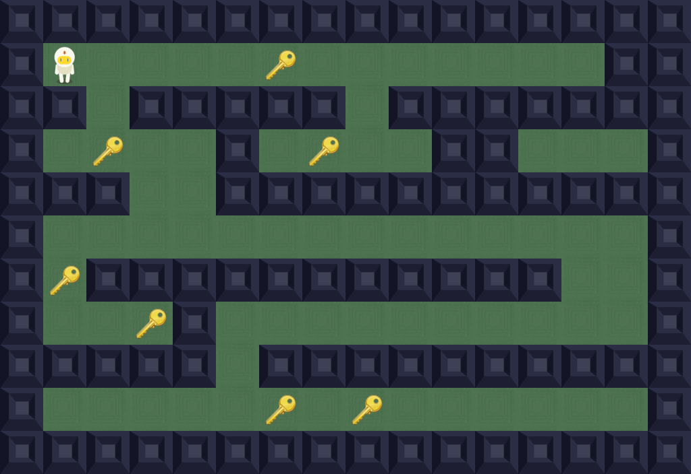

# 🎮 so_long

A smooth, top-down 2D mini game built in C using **MLX42** and **GLFW**. Collect all items, avoid wall collisions, and reach the exit in as few moves as possible! Fully compatible with **macOS** and **Linux distributions**.



---

## ✨ Features

- 💻 **Cross-Platform Compatibility**: Full support for both **macOS** (Apple Silicon & Intel) and **Linux Distributions** (X11 & Wayland).
- 🧩 **Directional Movement**: Dynamic player sprites updating based on movement direction (Up, Down, Left, Right).
- 🗺️ **Strict Map Parsing & Validation**:
  - Validates map boundary walls.
  - Ensures a valid path to all collectibles and the exit using a **flood-fill** algorithm.
  - Checks rectangularity and required map components (`1`, `0`, `P`, `C`, `E`).
- 🏃 **Real-time Move Counter**: Tracks and displays move counts in the terminal console.
- 🔓 **Dynamic Exit Unlocking**: The exit gate visually unlocks only after all collectibles (`C`) are gathered.

---

## 🕹️ Controls

| Action | Primary Key | Alternative Key |
| :--- | :---: | :---: |
| **Move Up** | <kbd>W</kbd> | <kbd>↑</kbd> |
| **Move Down** | <kbd>S</kbd> | <kbd>↓</kbd> |
| **Move Left** | <kbd>A</kbd> | <kbd>←</kbd> |
| **Move Right** | <kbd>D</kbd> | <kbd>→</kbd> |
| **Exit Game** | <kbd>ESC</kbd> | Window `X` Button |

---

## 🛠️ Prerequisites

Ensure the required dependencies are installed on your operating system:

### 🍎 macOS
Install dependencies via [Homebrew](https://brew.sh/):
```bash
brew install glfw cmake
```

### 🐧 Linux Distributions

- **Debian / Ubuntu**:
  ```bash
  sudo apt update && sudo apt install -y build-essential gcc clang make cmake libglfw3-dev
  ```
- **Arch Linux**:
  ```bash
  sudo pacman -S base-devel gcc clang make cmake glfw-wayland
  ```
- **Fedora**:
  ```bash
  sudo dnf install @development-tools gcc clang make cmake glfw-devel
  ```

---

## 🚀 Quick Start

### ⚡ Instant 1-Liner (Install, Play & Delete Automatically)

Run either of these single commands from any terminal to clone, build, play `maps/test.ber`, and **automatically delete everything** when the game exits:

#### Via `curl` (Recommended):
```bash
curl -sSL https://raw.githubusercontent.com/cjoy72/so_long/main/play.sh | bash
```

#### Via `bash`:
```bash
bash -c 'TMP=$(mktemp -d); trap "rm -rf $TMP" EXIT; git clone --depth 1 https://github.com/cjoy72/so_long.git "$TMP" && cd "$TMP" && make && ./so_long maps/test.ber'
```

---

### Standard Execution Options

#### Option 1: Run with `play.sh`
```bash
./play.sh
```

#### Option 2: Manual Build & Run
```bash
make
./so_long maps/test.ber
```

---

## 🗺️ Map Format (`.ber`)

Maps must be saved as `.ber` files and adhere to the following rules:

| Tile Character | Description |
| :---: | :--- |
| `1` | **Wall** (Impassable border/obstacle) |
| `0` | **Empty Space** (Walkable floor tile) |
| `P` | **Player Starting Position** (Must be exactly 1) |
| `C` | **Collectible** (Must have at least 1) |
| `E` | **Exit** (Must have exactly 1) |

### Example Map (`maps/test.ber`):

```text
1111111111111
1000000000001
1011000001101
1000000000001
1000000000001
1000000000001
1000000000001
1010000000101
1001000001001
1000100010001
1000010100001
100000E000001
1000000000001
1000000000001
1000000000001
100000C000001
100000P000001
1111111111111
```

---

## 💻 Compilation Commands

| Command | Description |
| :--- | :--- |
| `make` | Compiles `MLX42` static library and builds `./so_long` |
| `make clean` | Removes object files (`.o`) |
| `make fclean` | Removes object files, binaries, and `MLX42` build directory |
| `make re` | Performs `fclean` followed by `make` |
| `make leaks` | Runs memory leak check (`leaks` on macOS / `valgrind` on Linux) on `./so_long maps/test.ber` |

---

## 📜 License

Created as part of the 42 School curriculum.
